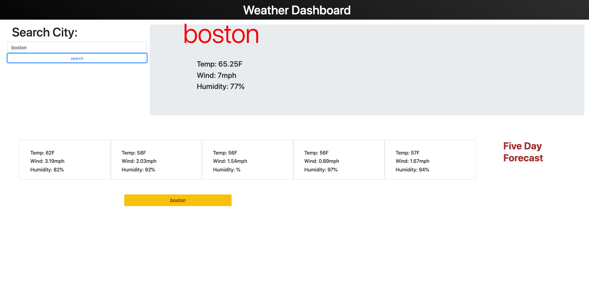

# weather-dash

## Table Of Contents
1. [Description](#description)
2. [Visuals](#visuals)
3. [Authors and Acknowledgement](#authors-and-acknowledgement)
4. [Resources](#resources)

## Description 
- During this project I ran into many issues that took up to much time. However, I am happy with how I arrived at my solutions and with what I learned during the process. PLEASE grade easy.

## Visuals

## Authors and Acknowledgement
- Ben Ashworth

## Resources
[Repo Link](https://github.com/bashworthj/weather-dash) 

[Live Site](https://bashworthj.github.io/weather-dash/)
 
